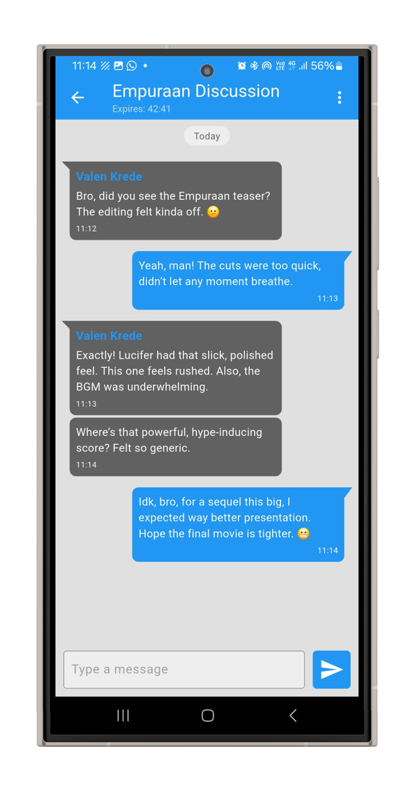
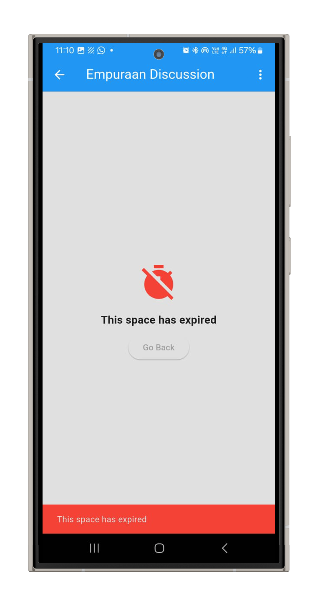

<!-- Banner or Emblem goes here -->
<p align="center">
  
</p>

# EchoSpace 
**Anonymous, Contextual Discussion Platform**  

EchoSpace is a real-time Flutter-based mobile app designed for creating temporary, anonymous, and topic-specific discussion spaces. It emphasizes mental wellness, social interaction, and ethical digital communication.

---

## 🔧 Technical Highlights

- 🔐 **AES-256 Encryption** for all chat messages using the Dart `encrypt` package
- 🧠 **ML-based Recommendation System** using Sentence Transformers for semantic space suggestions
- 🌐 **Firebase Integration**:
  - Firebase Authentication (email login)
  - Cloud Firestore (real-time chat & space metadata)
  - Cloud Functions (embedding generation, OTP email)
- 🧵 **Trie-based Foul Language Detection**: Prevents sending messages with flagged content
- 📱 Cross-platform support for Android and iOS (Flutter SDK)


## ⚙️ Setup Instructions (With Firebase)

To run this project on your machine with your own Firebase setup:

1. **Clone the Repository**

```bash
git clone https://github.com/VaishnavKrishnanP/EchoSpace.git
cd EchoSpace

```

2.  **Set Up Firebase Project**
    

-   Go to [Firebase Console](https://console.firebase.google.com/)
    
-   Create a new project
    
-   Add an Android app and/or iOS app
    
-   Download the `google-services.json` (Android) and/or `GoogleService-Info.plist` (iOS)
    

3.  **Add Config Files**
    

Place the downloaded Firebase config files:

```
android/app/google-services.json
ios/Runner/GoogleService-Info.plist

```

4.  **Enable Firebase Services**
    

Enable the following in Firebase Console:

-   Authentication → Email/Password
    
-   Firestore Database → Start in test mode
    
-   Cloud Functions → Deploy functions (embedding + OTP)
    

5.  **Install Dependencies**
    

```bash
flutter pub get

```

6.  **Run the App**
    

```bash
flutter run

```


## 📸 Screenshots
<table>
  <tr>
    <td align="center"><br/>1. Login</td>
    <td align="center"><br/>2. Register</td>
  </tr>
  <tr>
    <td align="center"><br/>3. OTP in App</td>
    <td align="center"><br/>4. OTP Email Example</td>
  </tr>
  <tr>
    <td align="center"><br/>5. Home Page</td>
    <td align="center"><br/>6. Sidebar</td>
  </tr>
  <tr>
    <td align="center"><br/>7. Recommendation Example</td>
    <td align="center"><br/>8. Recommendation Example</td>
  </tr>
  <tr>
    <td align="center"><br/>9. Chat Page</td>
    <td align="center"><br/>10. Chat Timeout</td>
  </tr>
  <tr>
    <td align="center"><br/>11. Create Space</td>
    <td align="center"><br/>12. Foul in Title (Space Creation)</td>
  </tr>
  <tr>
    <td align="center"><br/>13. Foul in Chat</td>
    <td></td>
  </tr>
</table>

## 📘 About the Project

EchoSpace was developed as part of the B.Tech Final Year Project to explore the use of ML-based personalization, real-time secure communication, and ethical moderation in online platforms. It aims to support mental health-oriented discussions through anonymity, privacy, and context-aware interactions.


## 🛡 License

This project is licensed under the **Creative Commons Attribution-NonCommercial 4.0 International License**.

You are free to:
- **Share** — copy and redistribute the material in any medium or format  
- **Adapt** — remix, transform, and build upon the material

Under the following terms:
- **Attribution** — You must give appropriate credit, provide a link to the license, and indicate if changes were made.  
- **NonCommercial** — You may not use the material for commercial purposes.

🔗 [Full License Text](https://creativecommons.org/licenses/by-nc/4.0/legalcode)  
🔗 [Human-readable Summary](https://creativecommons.org/licenses/by-nc/4.0/)


